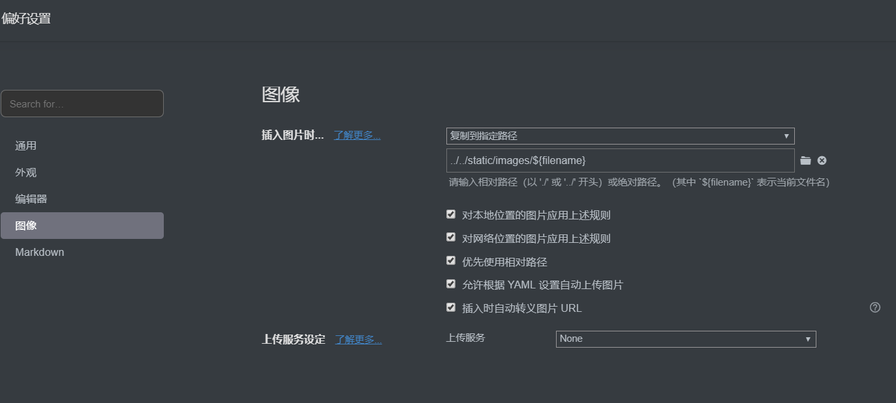

## 前言

工作中每次遇到问题都是看别人的博客，搜索大家的经验，有时自己也会写写笔记，记录一下方便下次遇到同样的问题，方便自己搜索。同时加深一下自己的印象。

也不知道谁说的，自己懂不是真的懂，能让别人也懂，那才是真的懂。就想着笔记也要记，还不如找个地方写个博客，打开浏览器就能搜到自己的内容，不也很方便嘛。说干就干，总结了下自己的需求，最后确定选择gitee+hugo这套搭建静态博客。为啥不建WordPress这样的动态博客，其实只是为了简单一点写写笔记随想，不想弄的太复杂，要搭建LNMP环境，以后博客迁移等也会麻烦一些。静态博客就很简单，就一些静态文件， git仓库保存，也不需要什么成本。

### 为啥选择gitee

github也是很好的选择，选择gitee纯粹是为了访问能快一点。github由于众所周知的原因，在国内时有发生奇怪的网络不通，其实用啥不重要，都是仓库，都是工具。gitee和github都提供pages服务，能把生成好的静态html放上去，然后会分配下来一个二级域名（比如test.github.io)，以后访问这个域名就会访问到仓库中的`index.html`。github可以绑定到自定义域名，而gitee这个功能则是收费的，看自己选择吧。以后打算同时部署到github和gitee。

### 为啥选择hugo

Hugo、Hexo都是很优秀的静态网站生成器。hexo是基于node js的，能支持插件，扩展性很好。而hugo从名字也能看出来，是基于go语言写的，没有插件，胜在速度块。各有优势，最后取舍选择了hugo。

### 写markdown的好帮手typora

一直以来都是用vscode写markdown，外观好看，而且不需要安装其他的工具。但是我安装的vscode插件不支持甘特图，数学公式等一些高级markdown语法。到处搜寻好的工具，发现很多人推荐typora，下载试试一下就被吸引了。

typora是专门写markdown的工具，各种高级语法就不用说了，外观也是很好看。而且不同于大多是markdown编辑器左右两栏，右侧预览的模式。typora所写即所得，写好markdown语法立即展示出预览的样子，当然也支持普通的源码书写方式。真是丝滑流畅，让人能专注于内容，不再被工具所烦扰

### 整体流程

安装好hugo，使用typora编辑markdown文章，hugo把文章生成html放到`public`文件夹下，最后把生成好的html静态文件推送到gitee或者github pages托管。然后就能使用gitee或者github提供的二级域名访问自己写的文章了

## 1. 安装

现在正题安装hugo。[参考官方文档](https://gohugo.io/getting-started/installing/)，文档很详尽。只有一个可执行文件，很简单

### windows平台

我是windows平台，用choco安装，没有安装choco的也可以github下载安装

```cmd
choco install hugo -confirm
```

提示我一个错误

```cmd
hugo not installed. An error occurred during installation:
对路径“C:\ProgramData\chocolatey\lib\hugo\tools”的访问被拒绝。
```

由于我用的是windows terminal和git-bash，没有使用管理员启动。猜测是权限问题，用管理员模式打开cmd再次执`choco install hugo -confirm`，这次没问题，安装成功

### mac平台

安装了homebrew的可以用homebrew安装

```shell
brew install hugo
```

### 验证一下是否安装正确

```shell
hugo version
Hugo Static Site Generator v0.70.0-7F47B99E windows/amd64 BuildDate: 2020-05-06T19:17:50Z
```

## 2. 创建一个站点

```shell
hugo new site ileeoyo
Congratulations! Your new Hugo site is created in C:\Users\username\ileeoyo.

Just a few more steps and you're ready to go:

1. Download a theme into the same-named folder.
   Choose a theme from https://themes.gohugo.io/ or
   create your own with the "hugo new theme <THEMENAME>" command.
2. Perhaps you want to add some content. You can add single files
   with "hugo new <SECTIONNAME>\<FILENAME>.<FORMAT>".
3. Start the built-in live server via "hugo server".

Visit https://gohugo.io/ for quickstart guide and full documentation.
```

站点已经建好，在`C:\Users\username\ileeoyo`，进去看看，里面有个content文件夹，这就是一个放markdown的文件夹。hugo会帮我们的markdown转成HTML。同时还提示我们需要安装一个主题

## 3. 安装主题

下面所有操作都要进入到站点目录下，我的目录是`C:\Users\username\ileeoyo`。把别人的主题放到`themes`文件夹下就可以了，我这里是用git子模块下载主题并管理的。可以修改站点目录下`config.toml`使生效，这个文件是配置文件，以后修改站点大多是修改这个文件

```shell
git init
# 这里我使用的是别人分享一个主题
git submodule add https://github.com/budparr/gohugo-theme-ananke.git themes/ananke
# 修改主题，也可以打开config.toml文件编辑
echo 'theme = "ananke"' >> config.toml
```

## 4. 创建一个markdown文件试试

```shell
hugo new "posts/hello world.md"
```

hello world中间有个空格，需要引号括起来

至此hugo安装完成。可以`vim content/posts/hello world.md`修改文件，或者用各种markdown编辑器，我用的是typora

```yaml
  ---
  title: "Test"
  date: 2020-05-09T20:15:41+08:00
  draft: true
  ---
```

这是md创建后初始的样子，上面的内容依次是标题，时间，草稿，是hugo文章的一些信息。可以在下面修改。比如先写个hello world

```yaml
---
title: "Hello World"
date: 2020-05-09T20:16:26+08:00
draft: false
---

程序员的第一篇博客，自然是hello world。
```

我将draft修改为false，草稿状态是不会被发布的

也可以不用命令创建文章，进入到`content/posts`文件夹下，手动新建一个markdown文件，只需要复制粘贴title，date等信息，修改一下，与命令生成并并无二致。

## 5. 本地预览

站点目录下执行

```shell
hugo server
```

然后打开浏览器输入`localhost:1313`即可看的生成的网页，同时修改markdown文件，会发现网页也会自动更新，实时看到预览效果

## 6. 部署到gitee

我是使用了两个git仓库，一个仓库保存原始hugo配置和md文件，我设为视为私有，也可以公开。一个仓库保存public文件夹下网页文件，使用pages服务，这个必须得公开，不然别人也没法访问。这样就算是换了电脑，只需要安装hugo，clone下hugo源文件仓库，就能开始继续编辑，达到云同步的效果

### 1. git管理整个hugo站点

在gitee上新建一个仓库，进入到刚才站点目录。仓库地址修改自己的仓库地址

```shell
git init
git remote add origin git@gitee.com:ileeoyo/reponame.git
```


### 2. git子模块管理public文件夹

先新建一个公开仓库，仓库名最好是用户名

> 用户名为ileeoyo,仓库名同时为ileeoyo时，git pages网页地址是https://ileeoyo.gitee.io/
>
> 如果仓库名户用户名不同名，比如叫abc，最后git pages网页的地址是https://ileeoyo.gitee.io/abc

然后

```shell
# 先删除之前的public文件夹，不然git submodule命令报错
rm -rf public
# 添加子模块管理public文件夹
git submodule add git@gitee.com:ileeoyo/ileeoyo.git
```

### 3. 部署

```shell
hugo -D
```

以后要部署需要先在站点目录执行`hugo -D`命令，生成最新的网页文件到public目录下。然后进入到`public`目录,先git add，commit，push等操作提交到仓库，然后回到站点目录，git add，commit，push等操作提交hugo源文件。

### 4. gitee pages

进入到刚才新建保存public文件夹的仓库，选择服务，Gitee Pages。选择部署的分支，我选的是master。部署目录，可以不填即部署整个目录。点击确定等待一下就行了。访问网址`https://ileeoyo.gitee.io`，已经可以访问。

以后每次推送了最新的网页文件，还需要到这个页面手动点击下更新才可以生效。可以看到右边显示gitee自动部署功能需要使用企业版或者pro版。github是可以自动部署的


## 7. 写个自动部署脚本

每次写完markdown后手动提交比较繁琐，可以写个简单的小脚本`deploy.sh`自动化，这里我用的是windows git-bash

```bash
#!/bin/bash
message=$1

# 生成HTML
hugo -D
# 提交html
cd public
git add .
git commit -m "$message"
git push
# 提交源文件
cd ..
git add .
git commit -m "$message"
git push
```

然后运行脚本，参数为git提交的描述信息。即可快速提交到仓库

```bash
./deploy.sh 提交描述信息
```


## 8.图片保存问题

平时很少需要保存图片，为了方便，打算图片和项目文件一同保存到git上，倒也方便。以后万一图片多了，在考虑图床吧。

先看下文件路径结构，便于展示，只显示部分相关的文件和文件夹。可以看到，保存到`static/images/a.png`图片，hugo构建后会放到`public`下，同样生成一个`images`文件夹，里面有`a.png`。而markdown文件现在在`content/posts`下。为了`hello world.md`中能展示`static`下的图片，需要相对路径`../../static/images/a.png`。此时markdown中展示图片没问题，但是部署后图片是没法显示的。

因为部署的是生成的`public`文件夹，我们的`hello world`页面 在`public/posts/hello world/index.html`，通过相对路径`../../static/images/a.png`去找图片，是找不到的。生成的图片路径是`public/images/a.png`,现在相对路径是`../../images/a.png`，与之前的图片路径不一致。这样就两难的选择，markdown中能显示，博客就没法显示。为了博客能显示，那么路径肯定markdown中就没法显示

```shell
├── config.toml
├── content
│   └── posts
│       └── hello\ world.md
├── public
│   ├── images
│   │   └── a.png
│   ├── index.html
│   ├── index.xml
│   ├── posts
│   │   ├── hello-world
|   |   |   └── index.html
│   │   ├── index.html
│   │   ├── index.xml
│   │   └── page
├── static
│   └── images
│       └── a.png
```

### 解决办法

目前选择的是typora作为markdown编辑器。这个编辑器有个方便之处就是复制粘贴图片可以自动保存本地或者图床。



我们可以在菜单`格式>图像>设置图片根目录`修改图片的默认根目录选择`static/`。然后在`偏好设置>图像>`，选择插入图片时复制到指定路径，然后路径填写`../../static/images/${filename}`。意思就是，我们把图片保存`static/images`路径下,为每个md文件创建一个文件夹保存图片。这样就没问题了

同时md文件的头部会增加一行`typora-root-url`标识

```yaml
title: "Test"
date: 2020-05-09T21:15:41+08:00
draft: false
typora-root-url: ..\..\static
```

## 参考

> [https://github.com/gohugoio/hugo](https://github.com/gohugoio/hugo)
>
> [https://github.com/xianmin/hugo-theme-jane](https://github.com/xianmin/hugo-theme-jane)
>
> [https://www.typora.io/](https://www.typora.io/)
>
> [https://gitee.com/](https://gitee.com/)

