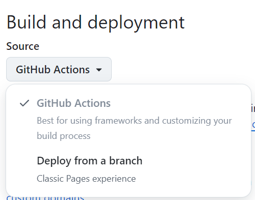

## 前言

距离首次用Hugo搭建博客已经时隔多年，Hugo版本升级也十分活跃，所用的jane主题也有了很大的更新。近日索性重新搭建Hugo博客，所用的Hugo版本为最新版本`0.138.0`，jane主题也是最新的master分支，平台由~~gitee Pages~~(服务已停用)换成GitHub Pages

## 开始

鉴于此前使用Hugo的经验，很多内容不再赘述，[参考上文Hugo搭建博客](./Hugo搭建博客)，只记录发生的新版本变化

### 1. 创建GitHub项目

[参考GitHub官网](https://pages.github.com/)

1. 注意：GitHub要求Pages仓库必须是public。

2. 与此前有所不同，现在创建一个仓库名称叫做`username.github.io`，username即为自己GitHub账户名。这样项目生成的GitHub Pages域名路径就是`username.github.io`。

以前GitHub Pages的要求是创建一个仓库名称必须为`username`，经过最新测试这样已经不行，这样生成的GitHub Pages域名路径是`username.github.io/username`

### 2. 本机安装Hugo

1. 安装最新的Hugo，windows上使用`choco install hugo-extended`，注意使用管理员命令行。
2. 安装dart-sass，我用的jane主题需要用上sass的特性，没安装Hugo启动会报错，干脆一起安装了。`choco install sass`。[参考Hugo官网介绍](https://discourse.gohugo.io/t/using-the-dart-sass-transpiler/41878)

### 3. 初始化Hugo项目

[参考官网quick start](https://gohugo.io/getting-started/quick-start/)

```shell
hugo new site username # 项目名，我这里同GitHub用户名
cd username
git init
git add .
git commit -m 'init'
git remote add origin $url
git push -u origin main
```

### 4. 添加jane主题

[参考GitHub项目](https://github.com/xianmin/hugo-theme-jane)

```shell
git submodule add https://github.com/xianmin/hugo-theme-jane themes/jane
```

修改配置文件hugo.toml

```toml
theme = 'jane'
```

### 5. 添加GitHub Actions

   [参考Hugo官网](https://gohugo.io/hosting-and-deployment/hosting-on-github/)

   创建文件`.github/workflows/hugo.yaml`

   ```yaml
   # Sample workflow for building and deploying a Hugo site to GitHub Pages
   name: 部署HUGO到GitHub Pages
   
   on:
       push:
           branches:
               - master
       # Allows you to run this workflow manually from the Actions tab
       workflow_dispatch:
   
   # Sets permissions of the GITHUB_TOKEN to allow deployment to GitHub Pages
   permissions:
       contents: read
       pages: write
       id-token: write
   
   # Allow only one concurrent deployment, skipping runs queued between the run in-progress and latest queued.
   # However, do NOT cancel in-progress runs as we want to allow these production deployments to complete.
   concurrency:
       group: "pages"
       cancel-in-progress: false
   
   # Default to bash
   defaults:
       run:
           shell: bash
   
   jobs:
       build:
           runs-on: ubuntu-latest
           env:
               HUGO_VERSION: 0.138.0
           steps:
               - name: Install Hugo CLI
                 run: |
                     wget -O ${{ runner.temp }}/hugo.deb https://github.com/gohugoio/hugo/releases/download/v${HUGO_VERSION}/hugo_extended_${HUGO_VERSION}_linux-amd64.deb \
                     && sudo dpkg -i ${{ runner.temp }}/hugo.deb
               - name: Install Dart Sass
                 run: sudo snap install dart-sass
               - name: Checkout
                 uses: actions/checkout@v4
                 with:
                     submodules: recursive
                     fetch-depth: 0
               - name: Setup Pages
                 id: pages
                 uses: actions/configure-pages@v5
               - name: Install Node.js dependencies
                 run: "[[ -f package-lock.json || -f npm-shrinkwrap.json ]] && npm ci || true"
               - name: Build with Hugo
                 env:
                     HUGO_CACHEDIR: ${{ runner.temp }}/hugo_cache
                     HUGO_ENVIRONMENT: production
                     TZ: America/Los_Angeles
                 run: |
                     hugo \
                       --gc \
                       --minify \
                       --baseURL "${{ steps.pages.outputs.base_url }}/"
               - name: Upload artifact
                 uses: actions/upload-pages-artifact@v3
                 with:
                     path: ./public
   
       deploy:
           environment:
               name: github-pages
               url: ${{ steps.deployment.outputs.page_url }}
           runs-on: ubuntu-latest
           needs: build
           steps:
               - name: Deploy to GitHub Pages
                 id: deployment
                 uses: actions/deploy-pages@v4
   ```

   ### 6. 设置GitHub仓库

在仓库的**Setting>Pages>Build and deployment**，选择Github Actions构建Pages，而不是Deploy from a branch



### 7. 迁移此前的Hugo文章

把以前写好的文章文件夹复制到新项目中。路径：`content/post`

### 8. 设置语法高亮

1. 注意：以下老版本使用的toml配置已废弃，添加后反而不能正常语法高亮。需要删除

```toml
PygmentsCodeFences = true # Enable syntax highlighting with GitHub flavoured code fences
PygmentsUseClasses = true # Use CSS classes to format highlighted code
PygmentsCodefencesGuessSyntax = true
PygmentsOptions = "linenos=table"
```

2. 添加新配置

```toml
[markup]
defaultMarkdownHandler = "goldmark" # blackfriday or goldmark
[markup.goldmark]
[markup.goldmark.renderer]
unsafe = true
[markup.highlight]
anchorLineNos = false
codeFences = true
guessSyntax = true
hl_Lines = ''
hl_inline = false
lineAnchors = ''
lineNoStart = 1
lineNos = true
lineNumbersInTable = false
noClasses = true
noHl = false
style = 'onedark'
tabWidth = 4
```

3. 选择语法高亮颜色主题

   [具体查看网址](https://xyproto.github.io/splash/docs/all.html)，有几十款主题供选择，只需要修改上面配置中的style即可，这里我使用的是onedark

### 9. 图片保存

1. ~~老办法~~

以前图片保存在`/static/images/文章名称/图片名称`，Hugo会在部署时吧`static`目录下的文件原封不动放入根路径。然后在文章中引用图片`/images/文章名称/图片名称`。这样网页就能正常显示图片，但是有个问题，在typora写md时，由于路径问题，不能正常显示图片。

所以需要在文章的yaml frontmatter中配置：

```yaml
---
typora-root-url: ../../static #配置图片的根路径
typora-copy-images-to: ../../static/images/${filename} # 导入或者粘贴图片时，自动把图片复制到以下目录
---
```

但是使用其他非typora编辑器仍然不能正常显示图片

2. 新办法

在创建新文章时，不直接创建`文章名称.md`文件，二是创建一级目录`文章名称/index.md`。这种方式叫做被叫做[page bundles](https://hugo.opendocs.io/getting-started/glossary/#page-bundle)

同时配置yaml frontmatter：

```yaml
---
typora-root-url: ./ # 此时可以不要这个配置
typora-copy-images-to: ./ # 可以不配置，添加文章图片时手动把图片放到当前文章目录下亦可，增加该配置只是用typora时更方便
---
```

这样粘贴图片时，图片直接放到和文章同一个目录下，引用图片时`./图片名称`。这样Hugo生成网页时，图片和文章也是同一级目录。而且在使用非typora编辑器也可以正常显示图片，比如***VsCode***

### 10. 图片加速

Github Pages有时访问会比较慢，这里用jsdelivr加速，同理也可以使用其他cdn，云存储。

参考Hugo官方文档[Markdown渲染钩子](https://hugo.opendocs.io/zh-cn/templates/render-hooks/#render-link%e5%92%8crender-image%e4%b8%ad%e7%9a%84%e4%b8%8a%e4%b8%8b%e6%96%87%e4%bc%a0%e9%80%92)和 [博客](https://wrong.wang/blog/20190301-%E6%9C%AC%E7%AB%99%E5%BC%95%E7%94%A8%E5%9B%BE%E7%89%87%E7%9A%84%E9%A1%BA%E6%BB%91%E6%B5%81%E7%A8%8B/)

1. 在`hugo.toml`配置文件中增加两个变量

```toml
[params.imgCDN.jsdelivr]
enable = true
host = "https://cdn.jsdelivr.net/gh/username/pages-repository@latest/content/" # 一直到content路径下
```
2. 新建如下文件`layouts/_default/_markup/render-image.html`

```html
{{- $img_destination := .Destination }}
{{ if (and .Page.Site.Params.imgCDN.jsdelivr.enable (not hugo.IsServer)) }}
    {{ $img_destination = (print .Page.Site.Params.imgCDN.jsdelivr.host (path.Join .Page.File.Dir .Destination)) }}
{{ end }}


```

上面html文件会hook渲染html生成img标签的环节，含义为：判断变量`params.imgCDN.jsdelivr.enable`开启，并且Hugo并不是运行在内置的开发服务器模式（本地启动调试），则替换图片标签src为`params.imgCDN.jsdelivr.host + fileDir + originalImageUrl`。

- 与博客中不同的是，这里使用了`.Page.File.Dir`而不是`.Page.RelPermalink`。jsdeliver引用的是Github仓库文件夹路径，应该使用`.Page.File.Dir`。

```
.Page.File.Dir Hugo生成前文件夹路径
.Page.RelPermalink Hugo生成后URL路径。此处使用jsdelivr应该引用.Page.File.Dir
```


## 参考

> [https://github.com/gohugoio/hugo](https://github.com/gohugoio/hugo)
>
> [https://github.com/xianmin/hugo-theme-jane](https://github.com/xianmin/hugo-theme-jane)
>
> [https://www.typora.io/](https://www.typora.io/)
>
> [https://pages.github.com/](https://pages.github.com/)
