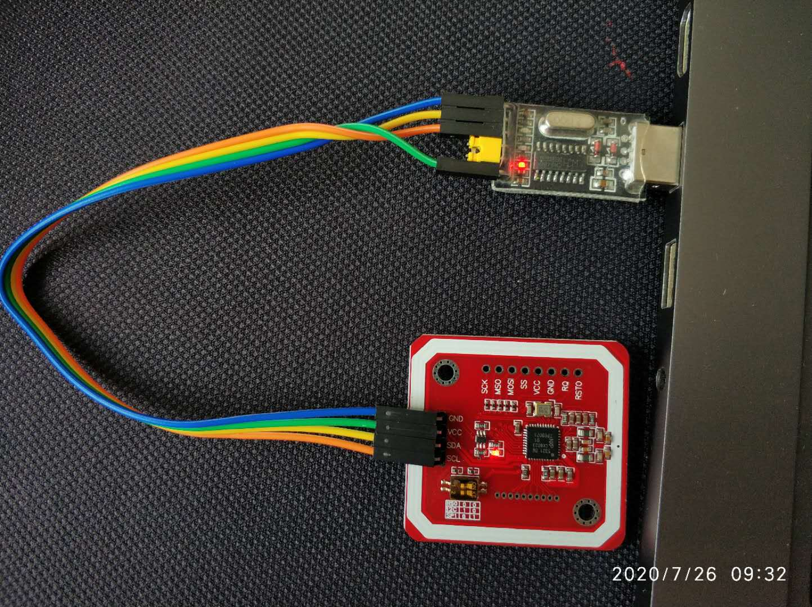
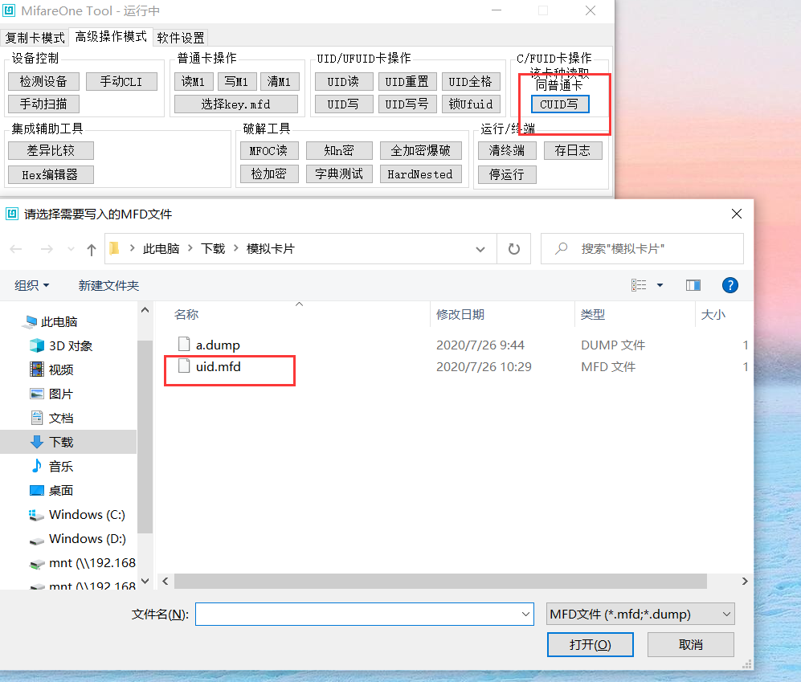

手头上有个小米6手机带全功能NFC，可以刷闪付，公交卡，或者模拟门卡。虽然手机软硬件都能支持模拟加密门卡，但是由于相关政策的原因，目前大多数手机，手环，都不能直接模拟加密门卡。那有没有什么办法模拟加密的门卡呢？答案当然是有的

### 常见的卡种类

#### ID 卡

ID 卡全称身份识别卡(Identification Card)，为低频卡，工作频率为  125KHz-1000Khz（与大部分手机、智能设备工作频率不同，无法模拟），编号固定，卡号公开，不可写入数据。判断是否是id卡，手机NFC触碰卡片，手机无反应，说明是id卡，或是工作频率与我们手机NFC不兼容，可以直接放弃手机模拟，此文不讨论此情况

#### IC卡（[以下介绍来自网络](https://post.smzdm.com/p/awx00qvk/)）：

1. **Mifare S50（M1）**:日常使用的电梯卡、门禁卡等智能卡发卡商所使用的都是 M1 卡，可以理解为物业发的原卡（母卡）。常见校园卡、公交卡等也是 M1 卡。M1 卡仅仅适合发卡方发新卡使用。0 扇区不可以修改，其他扇区可反复擦写
2. **UID卡**:普通 IC 复制卡，可以重复擦写所有扇区。UID 可被重复修改，响应后门指令（意味着可被使用后门指令检测是否为克隆卡的机器发现），遇到带有防火墙的读卡器就会失效。
3. **CUID卡**:UID的升级版，可擦写防屏蔽卡，可以重复擦写所有扇区，不响应后门指令(意味着不容易被反克隆系统发现)，可以绕过防火墙。
4. **FUID 卡**:不可擦写防屏蔽卡，此卡的特点 0 扇区只能写入一次，写入一次后变成 M1 卡，不能重复利用，修改后和 M1 卡完全一样，很难被屏蔽检测。
5. **UFUID 卡**:高级 IC 复制卡，可以理解为是 UID 和 FUID 的合成卡，需要封卡操作，不封卡就是 UID 卡，封卡后就变为 M1 卡。
6. **CPU卡**:CPU卡芯片内含有一个微处理器，配合操作系统即片上 OS，可以达到金融级别的安全等级。适用于金融、保险、交警、政府行业等多个领域。CPU 卡由 CPU 部分 7K 以及 M1 部分 1K 组成，最多破解其中 M1 部分，CPU 区域数据无法破解。实际上由于 CPU 部分和 M1 部分的数据会交互，所以基本上 CPU 卡无法破解。模拟门卡不考虑此种情况

本文主要使用UID或者CUID白卡中转模拟加密卡，需要手机或手环有NFC，支持模拟门卡（不支持模拟加密卡）

### 扇区信息

IC卡的数据存储有16个扇区（0-15）

**0扇区0区块**：

我们这里最关注的是0扇区，这部分数据由制造商写入。0区块前4个字节（8位）为卡号（UID），第5个字节为UID的校验值，后面几位为厂商信息（厂商信息无法修改，大部分门禁卡只读取UID，不会读取厂商信息，如果读取厂商信息，那么模拟后也无法使用）。模拟后的卡，除了0扇区的厂商信息字节不同，其他部分应该同原卡相同

**3区块**

每个扇区第 3 块由 A 密钥（前 6 个字节）+控制位（中间 4 个字节）+B 密钥（后 6 个字节）组成，其中控制位用于管理两个密钥的用途，及该扇区各块读写权限

****

### 模拟加密卡原理

手机或者手环识别到3扇区有加密，会拒绝模拟加密卡，但是这些NFC设备都是支持数据写入的（用到读卡器PN532）。那么我们通过中转的办法，实现模拟加密卡。

1. 读取原卡a信息到a.dump文件
2. 用一张白卡b，只把原卡0扇区0区块信息写入白卡（主要写入前8位卡号，厂商信息反正最终都无法修改），其他信息和密钥都不写。这样做成一个只包含原卡卡号的卡片b，由于不加密，手机或者手环是可以模拟的。
3. 使用手机或手环模拟卡片b，模拟完的卡片是卡片c
4. 然后用读卡器PN532把原卡a的信息a.dump全部写入到模拟的卡c中（除了0扇区0区块卡片id已经模拟过）。最终原卡a全部信息已经写入到模拟卡c（除了厂商部分信息无法修改）

### 全部物料

#### 硬件

淘宝买的PN532+CH340+UID白卡或CUID白卡+杜邦线，整套淘宝30包邮，算是比较便宜的方案了

1. **CH340**

CH340芯片用作USB转TTL，win10 2004可以自动安装驱动，运行稳定。也可以使用PL2303HX芯片。

2. **PN532**

PN532芯片是一个NFC芯片，可以用来读写NFC卡片。也有用pm3，acr122u芯片读写NFC的，PN532价格相比要便宜不少，大多数情况下也都能满足需求

3. **UID或CUID白卡**

针对不同卡片，可以选用UID或者CUID中转，实现模拟加密卡。CUID可以绕过防火墙，可在UID卡片失败后尝试CUID卡

4. **其他**

一根4线的杜邦线连接CH340芯片和PN532芯片

**准备工作：**

连接好CH340和PN532芯片，连线一一对应：**GND-GND，VCC-5.0V，SDA-RXD，SCL-TXD**

CH340芯片接入电脑的USB端口，成功后两块芯片都会红灯常亮。

#### 软件

MifareOne Tool 1.66版本

**准备工作：**

CH340插入会自动安装驱动，安装好驱动后，打开设备管理器会识别出便可以了。如果没有自动安装成功，也可手动下载CH340的驱动安装。

然后打开Mifare软件，点击`检测连接`，出现以下信息说明设备识别成功

### 方法一：使用UID白卡中转模拟加密卡

#### 步骤一：读取门禁卡信息到a.dump

门禁卡有加密，需要使用MifareOne一键解原卡功能，大多数情况能读取。

把门禁卡a放到PN532芯片上

点击`扫描卡片`，读取到卡片基本信息

点击`一键解原卡`，稍作等待，一会解码成功便会弹出保存框，这里我保存为`a.dump`，这个dump文件就包含了门禁卡的全部信息

#### 步骤二：把门禁卡卡号写入一个空白卡

把买的UID空白卡b放到PN532芯片上，点击`扫描卡片`，确保读取卡片正确。然后点击`高级操作模式->Hex编辑器`,

点击`文件>打开`，选择刚才保存的`a.dump`，加载门禁卡卡片信息，点击扇区0，选择右边第0块。复制前8位。关闭Hex编辑器

回到MifareOne主界面，选择`高级模式`，点击`UID写号`，粘贴刚才复制的8位卡号，点击确定。

终端提示`卡片已解锁`，说明卡号已经写入空白卡b

#### 步骤三：用手机（或手环）模拟卡片b

这里我使用的是小米6手机，打开小米钱包，找到门卡，点击第一个`门卡`

进入模拟卡界面，把刚才做好的白卡b放到手机NFC区域，等待一段时间就模拟成功了

手机已经模拟空白卡，手机叫做卡片c，目前只有0扇区第0区块有数据，其中前8位就是门禁卡的卡号

#### 步骤四：把门禁卡剩余信息全部写入手机模拟卡c

把手机调出卡片c，进入刷卡模式，放到PN532芯片上，点击`手动扫描`，确保识别正确

点击`CUID写`，选择保存的门禁卡信息a.dump，弹出的`KeyA/B/N`确认框选择`是`。写入成功后可以在终端看到`完成！写入了63/64个块`，一共64个区块，因为之前写入卡号已经占了一个区块

### 方法二：使用CUID白卡中转模拟加密卡

#### 步骤一：读取门禁卡信息到a.dump

同方法一

#### 步骤二：把门禁卡卡号写入一个空白卡

把买的CUID空白卡b放到PN532芯片上，点击`扫描卡片`，确保读取卡片正确。然后点击`高级操作模式->Hex编辑器`,

点击`文件>打开`，选择刚才保存的`a.dump`，加载门禁卡卡片信息，点击扇区0，选择右边第0块。复制前8位。

然后1点击`文件->新建`，2点击`工具->修改UID`，3粘贴上面复制的8位卡号，4点击`确定`

再点击`文件->另存为`，把我们刚新建的文件另存为`uid.mfd`。这样我们就制作了一个卡片信息，里面只有门禁卡的卡号信息，不包含其他数据。关闭Hex编辑器，回到MifareOne主界面

点击高级操作模式中的`CUID写`，选择上面制作的`uid.mfd`文件。

弹出`KeyA/B/N`选择框，选择`取消`

这样便把门禁卡的卡号信息写入到白卡b

#### 步骤三：手机模拟卡片b

同方法一

#### 步骤四：把门禁卡剩余信息全部写入手机模拟卡c

同方法一

### 方法三：使用小米空白卡直接写入加密卡

小米手机在某个版本开始支持`自定义空白卡`功能，相当一张白卡，可直接用读卡器写入数据。经测试小米6上，这种方法除了0扇区的厂商信息无法修改，0扇区的卡号同时也无法修改（方法一，二可以模拟出相同的卡号，厂商信息三种方法都不能模拟）。不同手机品牌，不同系统版本有所差异

如果手机支持空白卡，同时门禁不校验卡号的情况下，这个方法是最方便快捷的，不需要多余的UID或者CUID空白卡中转。其他不支持`空白卡`的手机或手环可以尝试上面两种方法，原理相通。

#### 步骤一：读取门禁卡信息到a.dump

同方法一

#### 步骤二：直接把a.dump写入到小米空白卡

点击小米钱包中的自定义空白卡功能，申请一个空白卡，命名为卡片c

把手机调出卡片c，进入刷卡模式，放到PN532芯片上，点击`手动扫描`，确保识别正确

点击`CUID写`，选择保存的门禁卡信息a.dump，弹出的`KeyA/B/N`确认框选择`是`。写入成功后可以在终端看到`完成！写入了63/64个块`，这种方法不能修改0扇区0区块。

### 注意事项

1. 有时写卡时提示错误`卡片已移开`，可以重复一次
2. 步骤一中读取门禁卡信息到a.dump，解码过程根据加密情况有概率解码失败，时间长短不一定，大多数情况能解码成功
3. 方法一，二模拟出的卡，除了0扇区0区块厂商信息其他与原卡一样，支持不校验厂商信息的门禁
4. 方法三模拟出的卡，除了0扇区0区块卡片id和厂商信息，其他与原卡一样，支持不校验卡片id和厂商信息的门禁（局限性比方法一，二大，但是更快捷）

### 格式化卡片

UID和CUID卡片可以多次覆写，很多情况下我们需要模拟不止一张卡片，在模拟完门禁卡后，UID白卡或者CUID白卡已经写入了数据。我们想让其恢复到**空白卡**的状态，方便下次使用

#### 非加密

白卡之前写入了非加密数据，格式化不格式化无所谓，下次再写入新的卡片数据便会覆盖上次的数据

#### 加密

如果白卡已经写入了加密数据，下次使用时想再次覆盖写入，会发现写入失败，提示有加密区。我们可以使用密钥，把卡片格式化成`空白卡`，便可以再次使用了

##### 步骤一

检测加密，提示有未知的keyA或KeyB，即卡片有加密区

##### 步骤二：制作密钥

点击`高级操作模式->Hex编辑器`，进入Hex编辑器

点击`文件->打开`，打开之前已经写入到白卡中的dump文件`a.dump`（a.dump有加密），然后点击`文件->另存为`，什么都不需要修改，直接另存为。我这里另存为`密钥.mfd`。关闭Hex编辑器

##### 步骤三：格式化卡片

把要格式化的白卡放到读卡器上，点击`扫描卡片`确保卡片识别正确。点击`高级操作模式->选择key.mfd`。选择步骤二中的`密钥.mfd`

点击`清M1`，终端显示`完成！写入63/64个块`，0扇区0区块不会被清，下次使用可以被覆盖。

这里，格式化卡片已经完成，恢复到空白卡状态，下次可以直接使用了

### 参考

[https://post.smzdm.com/p/awx00qvk/](https://post.smzdm.com/p/awx00qvk/ "https://post.smzdm.com/p/awx00qvk/")

[https://juejin.im/post/5e254e53e51d455260001861](https://juejin.im/post/5e254e53e51d455260001861 "https://juejin.im/post/5e254e53e51d455260001861")

[https://www.bilibili.com/video/av64196965](https://www.bilibili.com/video/av64196965 "https://www.bilibili.com/video/av64196965")

[https://www.bilibili.com/video/av64547677](https://www.bilibili.com/video/av64547677 "https://www.bilibili.com/video/av64547677")