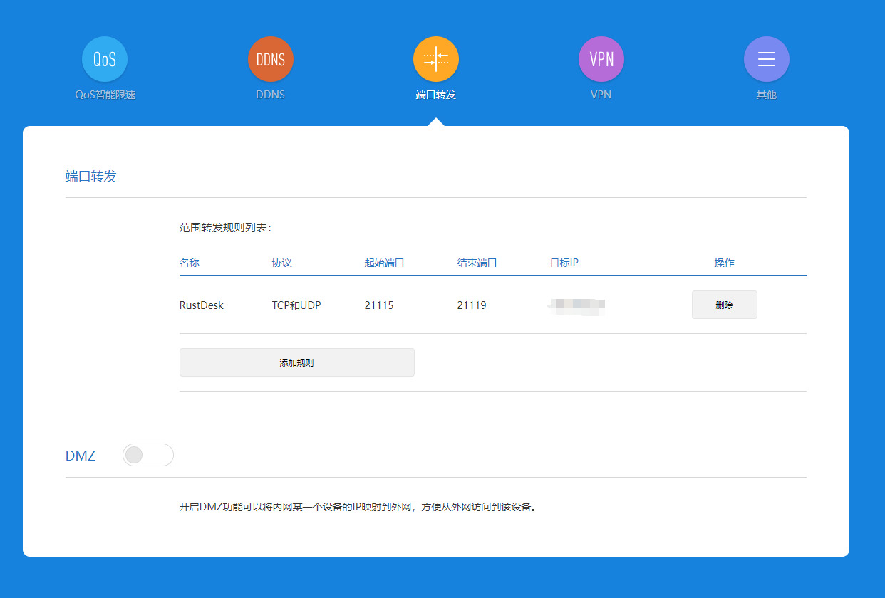
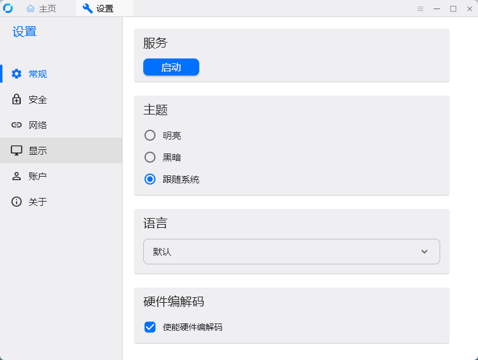
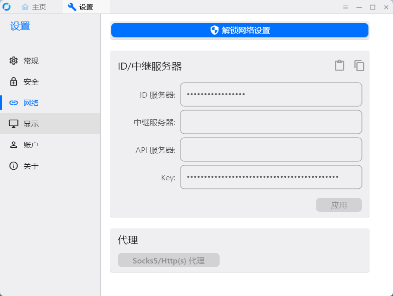
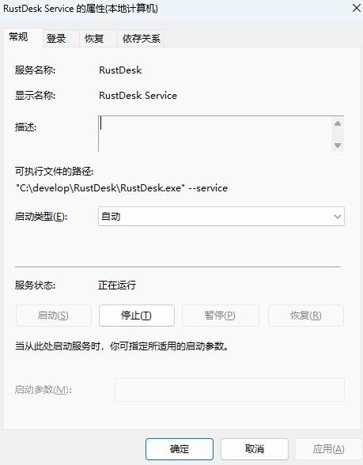

## RustDesk优势
一直以来尝试了不少远程工具，包括微软RDP，TeamViewer，ToDesk，AnyViewer。
- 最好用当属微软RDP，网络好的情况下（最好是局域网）有着近乎操作本地电脑的体验。延迟低，画质高，系统占用小。当然归功于Windows系统原生的支持。但是3389端口万万不可公网使用，已有不少开放3389端口中勒索病毒的先例。如果跨公网使用最好使用一些隧道技术，包括异地组网Zerotier，VPN隧道OpenVpn，还有N2N或者V2ray等等。通过隧道访问3389端口，确保安全
- TeamViewer也是远程电脑十分优秀的国外软件，但是商用收费十分昂贵，个人授权的权限日益收缩，甚至限制的设备数也越来越少了
- 后来一直在用ToDesk，这是一款国产软件，迭代速度很快，国内使用率也很高，但是也不是很稳定，有时会掉线，高峰期卡顿。会员权益变动比较随意，甚至还爆出几次比较严重的漏洞问题。好处是免费够用，一直作为主力
- AnyViewer简单用过一次，国外的服务延迟比较高，后续没在使用了

用RustDesk的最大原因是因为是开源，可以部署私有服务，自主可控，不用担心突然的服务收费或者权益变更。二是自己家里网络带宽高，而且有公网IP，可以充分发挥高上传的优势，不用担心高峰期卡顿。

当然RustDesk也有一些不足：开源版本比较简陋（商用版功能更丰富，但需付费），画质不太高。还有就是隧道RPD功能一直无法正常使用，也许是我没找到正确的姿势。

## 部署RustDesk服务端

Github官网：[https://github.com/rustdesk/rustdesk-server](https://github.com/rustdesk/rustdesk-server)

我是部署在家里的ArmV8 OpenWrt盒子上，充分发挥盒子的余热，功耗低只有区区几瓦。配合家里宽度的公网IP和DDNS服务，就可以当一个普通服务器使用。官方更推荐用docker的方式部署：[https://rustdesk.com/docs/zh-cn/self-host/rustdesk-server-oss/install/](https://rustdesk.com/docs/zh-cn/self-host/rustdesk-server-oss/install/)

### 下载

下载最新1.1.12版本：[https://github.com/rustdesk/rustdesk-server/releases/download/1.1.12/rustdesk-server-linux-arm64v8.zip](https://github.com/rustdesk/rustdesk-server/releases/download/1.1.12/rustdesk-server-linux-arm64v8.zip)

这里我根据自己OpenWrt盒子架构下载了Arm64V8版本，这是一个Zip压缩包，解压后有3个文件：`hbbr`,`hbbs`,`rustdesk-utils`

1. `hbbr`作为中继服务，远程时会先尝试打洞直连，如果打洞失败会走中继服务
2. `hbbs`是服务端，用作ID注册和心跳服务
3. `rustdesk-utils`有一些服务端常有的工具命令：生成密钥，校验密钥，服务检测

### 部署服务端

1. 复制`hbbr`，`hbbs`，`rustdesk-utils`到盒子服务器的目录下，一般在`/usr/bin/rustdesk`，但是在其他目录也无妨。

2. 添加执行权限`chmod u+x hbbr hbbs rustdesk-utils`

3. 添加开机自启动脚本，由于OpenWrt系统没有Systemd管理服务，使用了init.d。这里写2个init.d脚本。

   1. ` /etc/init.d/hbbr`

   ```shell
   #!/bin/sh /etc/rc.common
   # Copyright (C) 2008-2012 OpenWrt.org
   
   START=99
   USE_PROCD=1
   start_service() {
       logger -p daemon.info -t "hbbr" "starting hbbr server"
       procd_open_instance
       procd_set_param command /usr/bin/rustdesk/hbbr
       procd_set_param respawn
       procd_set_param stdout 1
       procd_set_param stderr 1
       procd_close_instance
       logger -p daemon.info -t "hbbr" "start hbbr server done"
   }
   ```

   2. ` /etc/init.d/hbbs`

   ```shell
   #!/bin/sh /etc/rc.common
   # Copyright (C) 2008-2012 OpenWrt.org
   
   START=99
   USE_PROCD=1
   start_service() {
       logger -p daemon.info -t "hbbs" "starting hbbs server"
       procd_open_instance
       procd_set_param command /usr/bin/rustdesk/hbbs
       procd_set_param respawn
       procd_set_param stdout 1
       procd_set_param stderr 1
       procd_close_instance
       logger -p daemon.info -t "hbbs" "start hbbs server done"
   }
   ```

4. 执行命令

   ```shell
   /etc/init.d/hbbr enable # 允许开机自启动
   /etc/init.d/hbbr start # 启动服务
   /etc/init.d/hbbs enable
   /etc/init.d/hbbs start
   ```

到这里看到服务已经启动，并且在根路径`/`下生成了5个文件，db开头的是数据库文件，id开头的是公钥和私钥。这里公钥私有后续有用。

```shell
id_ed25519
id_ed25519.pub
db_v2.sqlite3
db_v2.sqlite3-shm
db_v2.sqlite3-wal
```


>这里文件生成在了跟路径下十分怪异，强迫症有些受不了。RustDesk的文件是生成在执行命令的目录下，但是由于是init.d开机自启动，运行在跟路径下`/`，搜寻了很久也没找到指定init.d脚本执行工作目录的办法（Systemd有WorkingDirectory参数）。而且RustDesk也没有指定文件目录的参数。暂且作罢，希望后续能有更好的解决方案

## 配置网络

家里的主路由器使用的小米路由，需要设置好端口转发。

- hbbs：21115（TCP）, 21116（TCP/UDP)， 21118(TCP)
- hbbr：21117(TCP)，21119(TCP)

其中21115是hbbs用作NAT类型测试，21116/UDP是hbbs用作ID注册与心跳服务，21116/TCP是hbbs用作TCP打洞与连接服务，21117是hbbr用作中继服务, 21118和21119是为了支持网页客户端。如果您不需要网页客户端（21118，21119）支持，对应端口可以不开。

这里为了方便，我直接开启21115-21119端口段的TCP和UDP服务



## 安装Windows客户端

Github官网：[https://github.com/rustdesk/rustdesk](https://github.com/rustdesk/rustdesk)

### 下载

下载最新1.3.2Windows版本：[https://github.com/rustdesk/rustdesk/releases/download/1.3.2/rustdesk-1.3.2-x86_64.msi](https://github.com/rustdesk/rustdesk/releases/download/1.3.2/rustdesk-1.3.2-x86_64.msi)

### 安装

双击安装微软msi安装包就已经安装好了。

### 启动服务

点击`设置>常规>服务>启动`，这里需要超级管理员权限



### 设置自建服务端地址和密钥

点击`设置>网络>解锁网络设置`，设置完成点击应用



1. ID服务器填写家里宽带DDNS域名，端口如果用RustDesk默认的2111x端口可以不填。中继服务费和ID服务器在同一台机器上也可以不填
2. Key填写之前RustDeskServer生成的密钥对，这里用的是公钥`id_ed25519.pub`里面的文本内容

### 设置完成

回到RustDesk主界面，看到底部显示就绪，这样就说明已经连接上服务器，并且服务正常


### 设置开机自启动

Windows RustDesk在设置中启动服务后会在Windows服务中注册一个Service，但是如果右下角托盘点击退出后，会同时删除刚刚创建的服务。这样就没法开机自启动，可能RustDesk在设计上认为，退出了托盘，就是不想再自启了。我的RustDesk安装路径在`C:\develop`下，可以看到软件注册的服务命令是`"C:\develop\RustDesk\RustDesk.exe" --service`，服务名称是`RustDesk`



1. 这样我们模仿软件注册的Service，手动创建一个Service。先把RustDesk右下角托盘退出，在管理器权限下CMD终端输入以下命令。注意Service服务名称不要和软件自身创建Service相同，**不要叫做`RustDesk`**，避免自己创建的服务被RustDesk删除。这里我的服务名是`RustDeskServer`

    ```
    sc.exe create RustDeskServer binPath="C:\develop\RustDesk\RustDesk.exe --service" start=auto DisplayName="RustDesk Server"
    ```

2. 打开系统服务，找到RustDeskServer，右键启动，等待服务显示正在运行即可。

3. 打开RustDesk程序，主界面下方应该显示“就绪”，而不是“启动服务”按钮。说明我们自己创建的服务已经在运行就绪

这样，我们已经实现的Windows上RustDesk服务的开机自启，直接可以被其他电脑远程。而且没有打开主窗口，右下角也没有托盘。如果想远程其他电脑，只需要手动打开RustDesk软件即可，点**x**关闭窗口，服务也不会被退出，仍然可以被其他电脑远程。

> 参考：[https://akirachan.notion.site/Windows-RustDesk-2faf90921e98433d9a573e4589bafecd](https://akirachan.notion.site/Windows-RustDesk-2faf90921e98433d9a573e4589bafecd|https://akirachan.notion.site/Windows-RustDesk-2faf90921e98433d9a573e4589bafecd)

## 结语

使用了几天RustDesk体验十分良好，延迟比较低（家里宽带网络好的优势），目前已经作为主力使用。ToDesk作为备用方案，防止单一方案故障。后续继续探索RustDesk的Tcp Tunnel功能和RDP功能（基于Tcp Tunnel）
