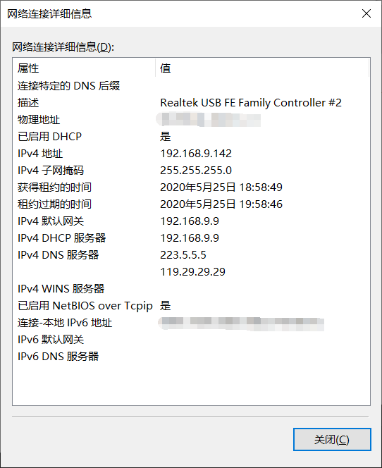
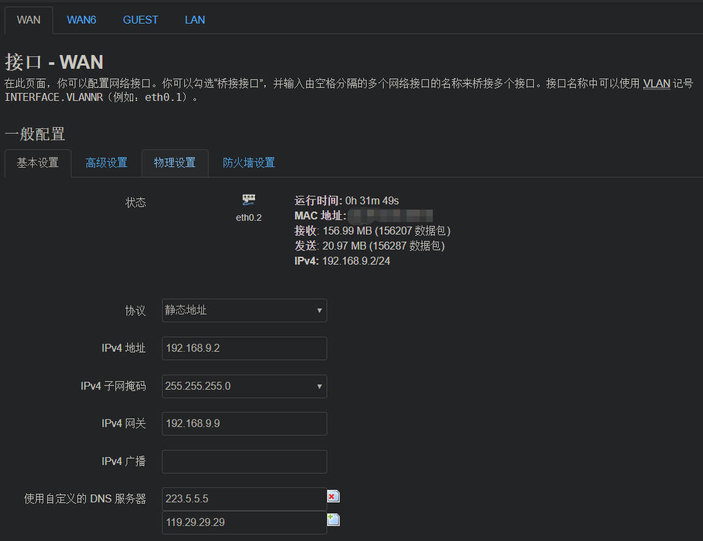

## 奇葩的网络故障

周末房间的无线网又不行了，以前也时有发生，但是从来没有研究过是为什么，一般过一两天就好了。也不是不想去找出故障，主要的原因是目前的网络是房东提供的宽带，房东有个大路由器放在弱电箱拨号，然后LAN口拉出网线到各个房间给我们租客使用，我再把这个网线接到自己的无线路由器WAN口上，发射wifi，方便手机电脑使用。网络不行一般都是房东的宽带问题，看到那一团乱麻的弱电箱，我也没有宽带账号和房东路由的管理权，着实也没有办法，只有等待。索性每次等待时间无需太久，一般一两天就好了

## 冲突升级，不能再忍

周末两天已经过去，到了今天周一晚上网络还不行，实在忍不了了，得找找路子

## 找出问题

我开始排查是不是路由器配置的问题。登录路由器，看了下WAN口已经获得IP`192.168.1.101/24`(我的WAN口设置从DHCP自动获取IP)。我ssh登录路由器，ping WAN口网关`192.168.1.1`，可以ping通，说明上级网关没问题，WAN口IP也没问题。ping baidu不通，外网访问不通。感觉路由器设置没问题

### step2

我把网线拔出来，直接插到电脑上。奇怪的事发生了，居然能访问百度了，神马情况？检查电脑自动获取的IP，居然获取的IP是`192.168.9.142/24`，网关是`192.168.9.9`，和刚才路由器上获取的网关都不一样，ping`192.168.9.9`没问题，看了这个IP才是正确的上级路由网关。那刚才路由器上获取的上级网关`192.168.1.1`是谁呢？为什么路由器和自己电脑获取到不同的网关呢？

### step3

看到这样的情况，第一时间怀疑上级路由的局域网内，存在两个DHCP服务器，一个IP是`192.168.9.9`，而我路由器获取的`192.168.1.1`是另一个错误的，获取到错误的网关，没法上网是肯定的。一般都是路由器负责DHCP分配，所以这个`192.168.1.1`很可能是一个路由器？路由器的话就好办了，一般路由器都有web管理页面，我尝试用浏览器访问`192.168.1.1`，果然出现了熟悉的页面，这不就是水星路由器的管理页吗。

看来是哪个大佬用了水星路由器，把房东的网线插到了路由器LAN口上，DHCP默认是开启的肯定也没关。一个局域网存在两个DHCP服务分配IP，我的路由器时而获取到正确的IP，时而获取到错误的IP，难怪网络时好时坏，这种随机性暂时还不知道有什么策略，可算把我坑到了

### step4

原因找到了，问题就很好解决了。

1. 找到水星路由器的主人，让他关了路由器，拔网线，或者让他把网线插WAN口上
2. 修改自己路由器配置，把原来的DHCP获取WAN IP的模式修改为固定WAN IP

显然第二种方式比较简单，找别人太麻烦了，挨个敲门不说，万一局域网内不只一个这样的大佬，房东网络中有四五个DHCP服务也说不定，不能挨个找人啊。最后决定，修改自己的路由配置

### step5

电脑直插网线可以上网，说明获取到的IP和网关都是正常的，网关是`192.168.9.9`。先随意ping一个同网段的IP检测是否已经被占用。我ping的是`192.168.9.2`，无法ping通，说明局域网内这个IP还没人使用。现在手动设置路由器网关为`192.168.9.9`，和电脑获取的一样。IP我就设置的是`192.168.9.2`，这个IP还没被占用，不会冲突。如果被占用了再换一个同网段的IP。

### Step6

见证奇迹的时刻，保存结束，右下角wifi的已经正常。访问百度能正常访问了

## 总结

这种情况自己安装二级路由最好是网线插在自己路由器的WAN口上，使自己的局域网和房东的大局域网分开。非要插在LAN口上，最好还是关闭DHCP服务器，方便了大家。以后再出现网络不通的问题，可能是自己设置的固定IP`192.168.9.2`和房东局域网内某个人的冲突，还可能是房东路由器换了网段，or换了IP？都有可能，也能尝试从这方面排查下。最后在怀疑房东的宽带问题或者网络线路问题

总之，人还是不能太懒，早点找出问题，以前也不至于受到这么多次的煎熬。