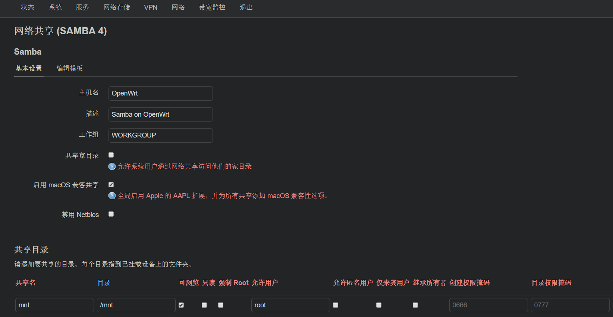
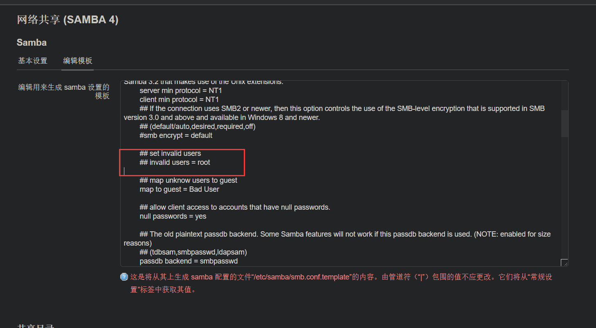
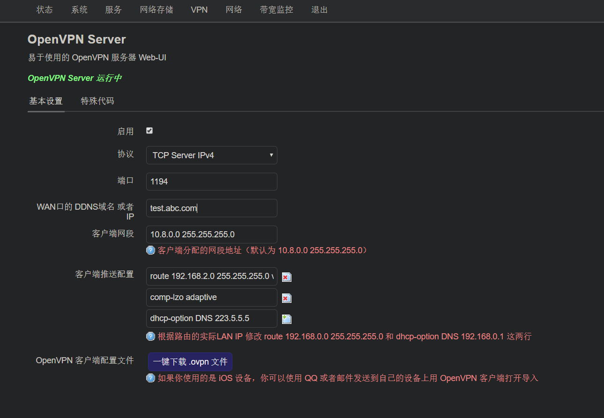
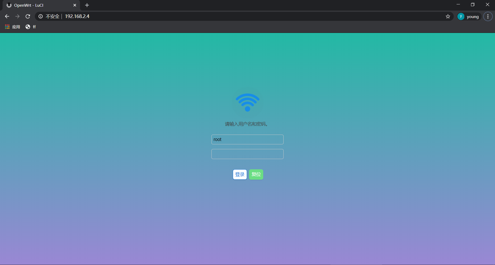
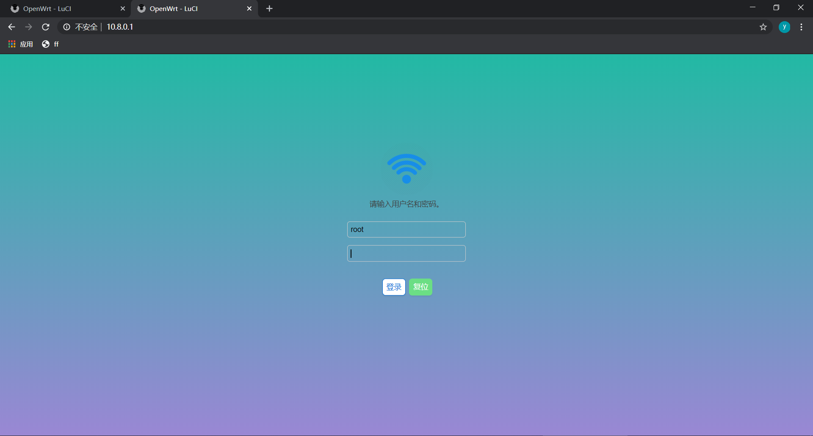
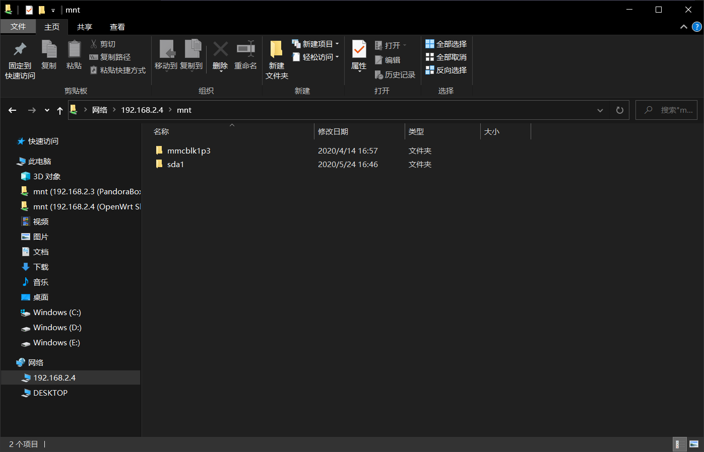
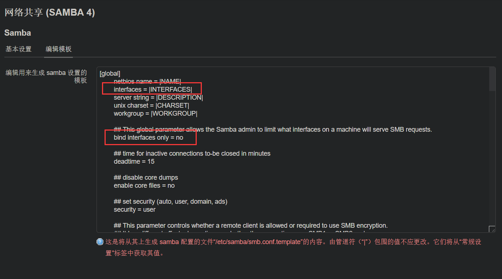

## 远程访问家里samba共享

家里放了一个n1盒子，刷了openwrt系统当做一个简单的小主机，平时当做下载机或者存储一些文件。文件存好了，怎么随时随地访问便成了一个问题。已知：家里宽带有公网ip，有一个刷了openwrt系统的n1盒子做旁路由

## 方案探究

### 1. 开启ftp服务或http服务

目前已经在n1盒子上开启了ftp服务和可道云的http网盘服务。但是ftp没法像samba那样，虽然方便上传下载，但是播放远程视频必须得先下载在播放，等待下载也是不友好的。http的网盘服务倒是方便播放，但是我就想如同使用本地文件一样使用远程文件，还是samba比较方便，可以映射成一个磁盘

### 2. ~~开放samba端口远程访问~~

查询到samba使用445端口或139端口，但是2017年永恒之蓝漏洞事件后，ISP便把公网445端口给ban了，也就没法映射445端口到公网访问。考虑过设置端口映射4455到445端口，但是Windows自带explorer访问的smb服务器，没法指定其他端口，只能以445端口访问。而且smb有安全漏洞，就算ISP没ban，也不好开放公网访问。只好作罢

### 3. ~~proxifier+sock5代理~~

proxifier可以接管电脑流量发送到指定的sock5代理。打算用proxifier接管445端口的流量，都发送到家里的n1盒子sock5 server服务上。但事实上发现proxifier无法接管windows samba的流量，原因还不清楚

### 4. 异地组网

可以使用n2n，zerotier one，或者openvpn组网。为n1盒子和本地电脑组建一个局域网。我选择了openvpn组网，为n1分配ip`10.8.0.1`,本地电脑分配ip`10.8.0.2`，这样直接访问10.8.0.1访问n1盒子的samba服务。其他的n2n，zerotier one也都可以

## 开启samba访问

这里我共享了/mnt目录，允许本地root用户访问，注意*编辑模板*里面一定要注释掉`invalid users = root`这行，不然是没法用root用户访问的





## 开启openvpn server

我装的openwrt系统已经把openwrt server安装好了，只需要开启即可

- n1盒子网段`192.168.2.0 255.255.255.0`,ip为`192.168.2.4`
- 客户端电脑网段`192.168.1.0 225.225.225.0`



1. 我选择tcp协议，1194端口，注意要在路由器防火墙设置1194端口流量转发到n1盒子
2. 设置好WAN的DDNS域名，这里我用test.abc.com，注意换成自己的宽带ddns域名

3. 客户端网段我使用了默认的，注意和客户端电脑网段，n1盒子的网段不冲突即可

4. 客户端推送配置

    - 删除`redirect-gateway def1 bypass-dhcp`这一行，如果没有则不需理会。
    - `dhcp-option DNS`不设置也可以

    - 增加一行`route 192.168.2.0 225.225.225.0`,为每个客户端推送n1盒子的路由

配置`redirect-gateway def1 bypass-dhcp`是修改所有客户端的默认网关都将重定向到VPN，意思是客户端电脑的全部流量走vpn，这里我只是想访问n1盒子的文件，不想访问百度等其他网站时都走vpn绕一圈，自然要删除这一行。然后增加路由规则`route 192.168.2.0 225.225.225.0`，指定如果访问`192.168.2.*`ip时，走vpn。如果只为了访问n1盒子其实不加这个路由规则也可以，可以直接访问`10.8.0.1`vpn网关访问n1盒子。加上了，我们还可以访问`192.168.2.*`的其他ip，比如n1盒子同一局域网下其他电脑

> 参考
>
> [http://www.voidcn.com/article/p-fosgwdko-bgz.html](http://www.voidcn.com/article/p-fosgwdko-bgz.html)
>
> [https://www.atfeng.com/post/wordpress/1009/](https://www.atfeng.com/post/wordpress/1009/)
>
> [https://6xyun.cn/article/97](https://6xyun.cn/article/97)

设置完成，n1盒子分配ip`10.8.0.1`，其他接入的客户端会分配ip`10.8.0.2-255`。点击`一键下载.ovpn文件`，待会客户端要用

### 下载Windows客户端

在官方[https://openvpn.net/community-downloads/](https://openvpn.net/community-downloads/)上下载`openvpn-install-2.4.9-I601-Win10.exe`。点击安装，我的安装路径是`C:\Software\OpenVPN`

拷贝刚才的`.ovpn`文件，到`C:\Software\OpenVPN\config`目录，对应自己的配置文件目录。双击`C:\Software\OpenVPN\bin\openvpn-gui.exe`运行。桌面状态栏出现openvpn client图标，右键菜单，点击连接。即可根据刚才的`.ovpn`配置文件连接。连接上便为电脑分配一个`10.8.0.2`的ip


### 测试访问

浏览器访问n1盒子的ip`192.168.2.4`，可以访问n1盒子的管理页面



访问n1盒子的openvpn服务对应ip`10.8.0.1`,同样可以访问到n1盒子的管理页面



## 访问samba

刚才配置了samba的路径为mnt目录，可以访问`\\192.168.2.4\mnt`，访问到n1盒子samba服务



但是使用`\\10.8.0.1\mnt`却无法正常访问，很是奇怪

排查n1盒子samba监听端口，发现只监听了n1盒子的LAN IP `192.168.2.4:445`和WAN IP`192.168.2.220:445`，而我用openvpn接口ip`10.8.0.1`访问自然无法访问。

```bash
root@OpenWrt:~# netstat -apn |grep 445
tcp        0      0 192.168.2.4:445         0.0.0.0:*               LISTEN      5601/smbd
tcp        0      0 192.168.2.220:445       0.0.0.0:*               LISTEN      5601/smbd
```

修改samba模板中的参数`bind interfaces only = no`


参数`bind interfaces only`为`yes`时会为samba服务绑定参数`interfaces = |INTERFACES|`中的接口，在我的n1盒子对应接口`eth0`，接口eth0对应LAN IP `192.168.2.4`和WAN IP`192.168.2.220`。设为`no`,不做绑定即可，重启samba服务，检查监听端口，此时监听端口已经是`0.0.0.0:445`，使用`\\10.8.0.1\mnt`访问samba服务正常

```bash
root@OpenWrt:~# netstat -apn |grep 445
tcp        0      0 0.0.0.0:445             0.0.0.0:*               LISTEN      5604/smbd
tcp        0      0 :::445                  :::*                    LISTEN      5604/smbd
```


